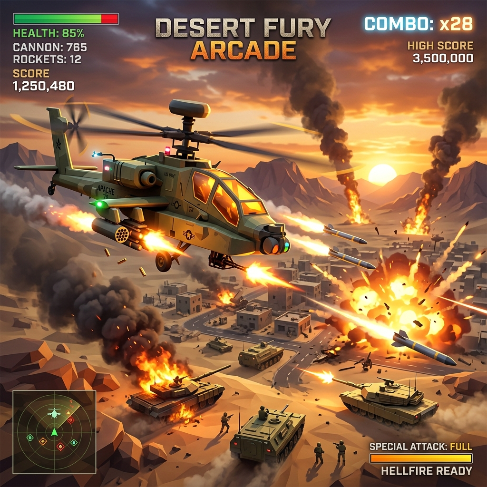

# 🚁 SKY STRIKE 🚁

<div align="center">

  
  **High-Octane 2.5D Side-Scrolling Arcade Combat**
  
 
</div>

---

## ⚡ MISSION BRIEFING

Welcome to **SKY STRIKE**, the ultimate high-fidelity arcade shooter. Take control of the elite **Boeing AH-64 Apache** attack helicopter and dominate the battlefield. Engage ground forces, evade missile locks, and survive the onslaught of enemy drones and armored columns.

## 📸 GAMEPLAY SHOWCASE

<div align="center">
  
  <p><i>Command the skies with the high-fidelity Boeing AH-64 Apache Attack Helicopter, featuring custom tandem cockpit, nose targeting turret, spinning main and tail rotors, Hydra-70 rocket pods, and AGM-114 Hellfire guided missiles.</i></p>
  
  
  <p><i>Intense aerial combat with advanced enemy AI, dynamic effects, and tactical gameplay elements.</i></p>
</div>

---

## 🌟 FEATURES
*   🔥 **Hyper-Fast Combat**: Seamless 2.5D side-scrolling action with high-fidelity visuals.
*   🔊 **Procedural SFX Engine**: Real-time generated audio for every vulcan shot, missile launch, and explosion.
*   🚁 **Advanced Flight Physics**: Responsive arcade flight controls that make you feel like an ace pilot.
*   🎖️ **Tactical HUD**: State-of-the-art interface with hull integrity monitoring, combo tracking, and mission alerts.
*   🌆 **Dynamic Environments**: Battle across a beautifully rendered 2.5D landscape with real-time lighting and shadows.

---

## 🎮 CONTROLS

| KEY | ACTION |
| :--- | :--- |
| **W/S/A/D** | Flight Maneuvers |
| **MOUSE** | Aim Vulcan Cannon |
| **LEFT CLICK** | Fire Vulcan Cannon |
| **SPACE** | Launch Hellfire Missiles |
| **ESC** | Tactical Pause |

---

## 🛠️ QUICK START

Get airborne in minutes!

### Prerequisites
*   [Node.js](https://nodejs.org/) (LTS recommended)
*   A modern web browser with Web Audio Support

### Deployment
1. **Clone the repository**
   ```bash
   git clone https://github.com/arnav-tek/Sky-Strike-.git
   cd Sky-Strike-
   ```

2. **Install Ordnance**
   ```bash
   npm install
   ```

3. **Ignition**
   ```bash
   npm run dev
   ```

4. **Combat Entry**
   Open `http://localhost:5173` in your browser.

---

## 🛡️ LOADOUT

*   **Primary**: Vulcan M161 20mm Rotary Cannon
*   **Secondary**: AGM-114 Hellfire Guided Missiles
*   **Defense**: Active Hull Reinforcement & Combat Flares

---

<div align="center">
  <h3>STAY IN THE FIGHT. DOMINATE THE SKIES.</h3>
  <p><i>A project built for the love of arcade gaming.</i></p>
</div>
